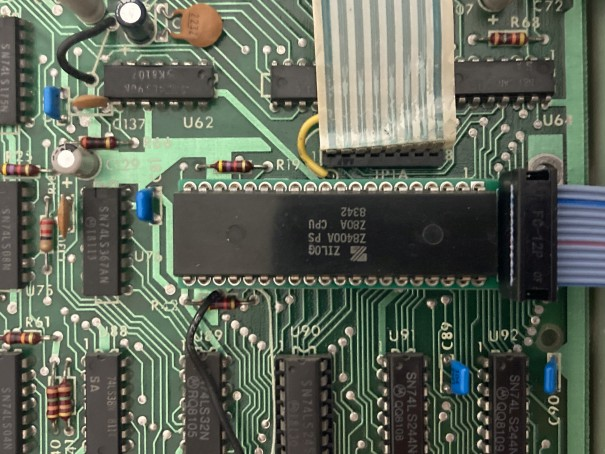
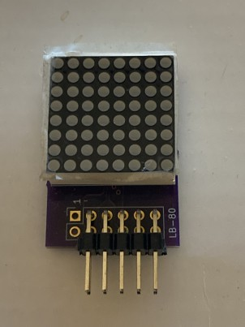
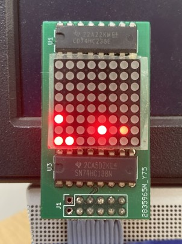

# LiteBrite-80

The LiteBrite-80 (LB-80) is a memory visualization gadget for Z80 systems.  It displays the 1k (8x8 display) or 256 (16x16 display) byte block being accessed by the Z80 (code and data read/write).  It is primarily intended for Z80 based TRS-80 systems (Models 1, 2 (12, etc), 3, and 4) but is applicable to any Z80 based system.

The LB-80 consists of two parts - a Z80 adapter and a display.  The Z80 adapter is a small PCB in which the Z80 is installed and replaces the Z80.  Ideally the Z80 is socketed in the host machine and the LB-80 is just installed in the socket - otherwise the Z80 must be removed and the LB-80 installed in its place or replaced with a socket.  The adapter has a connector to attach a display.  The display is a small PCB that contains an 8x8 or 16x16 LED array that can either plug directly into the adapter or more likely connected to the adapter via a cable so that the display can be located for convenient viewing.

## Adapter PCB

The adapter PCB design is available [here](kicad/Visual80-3).  The design is intended to be as compact as possible so to fit into about the space of the Z80 itself.  To achieve this the design is essentially a 40-pin socket - but with a small protrusion for the display connector.  The adapter could be used in place of a Z80 socket, or if installed in a socket is equivalent to stacking a second socket on top of the socket.

Adapter PCB installed in TRS-80 M3:

The design uses individual machine socket pins which can be removed from a machine socket or bare pins can be purchased.  The pins should be inserted in the PCB until the collar touches the top of the PCB - they might have a slight interference fit and need to be pressed into the PCB.

The connector pinout is compatible with the PMOD connector common to FPGA development boards.  The PMOD connector is simply a 2x6 connector with two GND pins, two Vcc pins, and eight signal pins.  For an 8x8 display only six signals are needed so a pinout that allows for a 10-pin connector for 8x8 display is used - this allows for use of a 10-pin cable when connecting the display via a cable.

The use of the PMOD connector also allows the display to be used with many FPGA boards for example if emulating a TRS-80 with an FPGA.

## Display PCB

An 8x8 display PCB design is available [here](kicad/lb-80), and is also in the [TRS-IO project](https://github.com/apuder/TRS-IO/tree/master/kicad/pmod/lb-80).

Here is an earlier version of the display - connected to TRS-80-M3 booted to the FreHD menu:

## Software

No special software is needed because the LB-80 just displays the natural behavior of the Z80 activity.  The resultant patterns are interesting and fun to watch but also often lend insight into what the Z80 is doing.

However, it is possible to contrive a program that generates certain patterns on the LB-80 display.  To light an individual dot on an 8x8 display requires that the Z80 be limited to the corresponding 1k block of memory (program, data, and stack).  To light a different individual LED would require the Z80 be limited to a different corresponding 1k block of memory.  To not light an LED would require the Z80 not touch the corresponding 1k block of memory.  So contriving such a program would be tricky.

### Marquee Display Program

A TRS-80 program [lb80text](source/lb80text) that displays scrolling marquee style text on the LB-80 is provided as one such example.  See the source code for detailed explanation of how the program works.  Several versions are provided.

The command syntax is `lb80text "string to display"`.  The quotes are optional and only required if the string has leading spaces.

It happens this demo program is a good stress case for memory.  Although using additional banked memory in the M4 and M2 really has no effect on the operation of the LB-80 itself some banked versions are included.

#### [TRS-80 Model 1 and Model 3 Version](source/lb80text/lb80txm1.asm)

For TRS-80 M1 with lowercase mod and 48k RAM, and M3 with 48k.  See source code for M1 without lowercase mod.

#### [TRS-80 Model 4 Version](source/lb80text/lb80txm4.asm)

For TRS-80 M4 with 64k.

#### [TRS-80 Model 2 Version](source/lb80text/lb80txm2.asm)

For TRS-80 M2 with 64k.  Very similar to M4 version but doesn't use display memory since the M2 can't run from display memory.

#### TRS-80 Model 4 128k Version

Coming...

#### [TRS-80 Model 2 512k Version](source/lb80text/lb80512k.asm)

For TRS-80 M2 with 512k.  A M2 (M12, etc) with 512k is a rare beast but if you are one of the lucky few with a [512k card by Ruud](https://www.youtube.com/watch?v=_I01NHzUzNk) this will give you something to test it with.  (Note: I also have a 512k card of my own design that's not yet ready for primetime but is my personal motivation for this version).

## Alternative Adapter Implementations

In systems that expose the Z80 bus an LB-80 adapter that connects to the bus rather than directly to the Z80 is possible.  Such systems include:
* TRS-80 Model 1
* TRS-80 Model 2 (12, etc)
* S100
